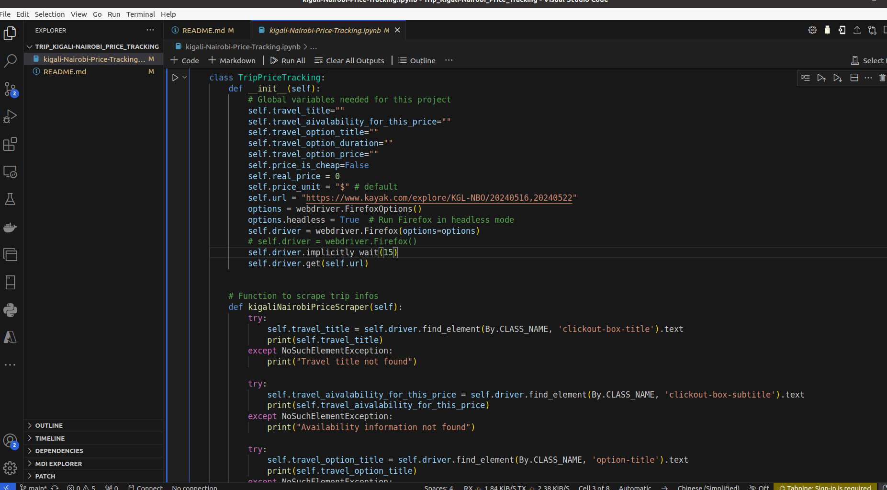

# Trip_Kigali-Nairobi_Price_Tracking
Trip_Kigali-Nairobi_Price_Tracking

### **Trip Price Tracking**

### **Overview**
This script tracks the prices of trips from Kigali to Nairobi using the Kayak website. It utilizes Selenium to scrape trip information including title, availability, duration, and price. It then checks whether the current price is considered cheap or not based on a predefined threshold.

### **Setup**
Ensure you have Python installed along with the necessary libraries like `selenium` and `webdriver`.

### **Usage**
1. Initialize an instance of `TripPriceTracking`.
2. Call the `kigaliNairobiPriceScraper()` method to scrape trip information.
3. Call the `price_checker()` method to extract and process the price.
4. Call the `is_price_cheap()` method to check if the price is considered cheap.
5. Finally, call the `close_driver_window()` method to close the WebDriver window.

### **How to Run**
1. Install the necessary libraries using `pip install selenium`.
2. Download the appropriate WebDriver for your browser (e.g., GeckoDriver for Firefox).
3. Update the WebDriver path in the script.
4. Run the script.

### **Dependencies**
- Python 3.x
- Libraries: `selenium`, `webdriver`

### **Notes**
- Ensure the WebDriver path is correctly set in the script.
- Adjust the price threshold in the `is_price_cheap()` method as needed.
- Customize the error handling and logging according to your requirements.

### **Contributors**
- Gabin H. VEGLO

### **License**
#**This project is licensed under the MIT License.**#
